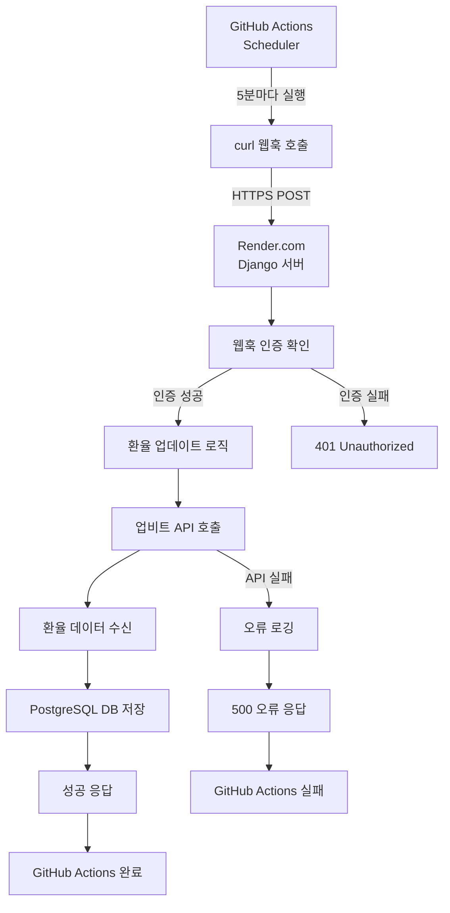

# GitHub Actions를 사용한 환율조회 자동화 가이드 (웹훅 방식)

SatoShop에서 GitHub Actions를 활용하여 업비트 BTC/KRW 환율을 자동으로 업데이트하는 시스템 구축 가이드입니다.

## 🎯 개요

GitHub Actions를 사용하여 주기적으로 실제 서버의 웹훅 엔드포인트를 호출하여 환율을 업데이트하는 시스템입니다. 이 방식은 데이터베이스 연결 문제를 해결하고 실제 프로덕션 환경과 완전히 연동됩니다.

### 핵심 특징
- ✅ **완전 자동화**: 5분마다 자동 실행
- ✅ **안정적 연결**: 실제 서버의 웹훅을 통한 환율 업데이트
- ✅ **실시간 환율**: 업비트 API 연동으로 정확한 환율 제공
- ✅ **오류 처리**: 실패 시 자동 알림 및 상세 로깅
- ✅ **보안**: 토큰 기반 인증으로 무단 접근 방지
- ✅ **비용 효율**: GitHub Actions 무료 사용량 내에서 운영

## 🏗️ 시스템 아키텍처 (웹훅 방식)



## 📁 주요 구성 요소

### 1. GitHub Actions 워크플로우 (웹훅 방식)
**파일**: `.github/workflows/update-exchange-rate.yml`

```yaml
name: 환율 자동 업데이트

on:
  schedule:
    # 5분마다 실행 (UTC 기준)
    - cron: '*/5 * * * *'
  workflow_dispatch: # 수동 실행 버튼

jobs:
  update-exchange-rate:
    runs-on: ubuntu-latest
    
    steps:
    - name: 환율 업데이트 웹훅 호출
      env:
        WEBHOOK_URL: ${{ secrets.WEBHOOK_URL }}
        WEBHOOK_TOKEN: ${{ secrets.WEBHOOK_TOKEN }}
      run: |
        echo "🚀 GitHub Actions에서 환율 업데이트 웹훅 호출 시작"
        echo "📡 서버 URL: ${WEBHOOK_URL}"
        
        response=$(curl -s -w "HTTPSTATUS:%{http_code}" \
          -X POST \
          -H "Content-Type: application/json" \
          -d "{\"token\": \"${WEBHOOK_TOKEN}\", \"source\": \"github_actions\"}" \
          "${WEBHOOK_URL}")
        
        body=$(echo "$response" | sed -E 's/HTTPSTATUS\:[0-9]{3}$//')
        code=$(echo "$response" | tr -d '\n' | sed -E 's/.*HTTPSTATUS:([0-9]{3})$/\1/')
        
        echo "📊 응답 코드: $code"
        echo "📄 응답 내용: $body"
        
        if [ "$code" -eq 200 ]; then
          echo "✅ 환율 업데이트 웹훅 호출 성공"
        else
          echo "❌ 환율 업데이트 웹훅 호출 실패 (HTTP $code)"
          exit 1
        fi
    
    - name: 실행 결과 알림 (실패 시)
      if: failure()
      run: |
        echo "❌ 환율 업데이트 웹훅 호출 실패"
        echo "GitHub Actions 로그를 확인하세요: https://github.com/${{ github.repository }}/actions"
        echo "서버 상태를 확인하고 WEBHOOK_URL과 WEBHOOK_TOKEN 시크릿이 올바른지 확인하세요."
```

### 2. Django 웹훅 엔드포인트
**파일**: `myshop/views.py`

```python
@require_http_methods(["POST"])
@csrf_exempt
def update_exchange_rate_webhook(request):
    """외부 서비스에서 환율 업데이트를 트리거하는 웹훅 엔드포인트"""
    import logging
    logger = logging.getLogger(__name__)
    
    try:
        # JSON 데이터 파싱 및 인증
        if request.content_type == 'application/json':
            data = json.loads(request.body)
            auth_token = data.get('token')
            source = data.get('source', 'unknown')
        
        # 보안 토큰 확인
        expected_token = os.getenv('WEBHOOK_TOKEN')
        if not auth_token or auth_token != expected_token:
            return JsonResponse({
                'success': False,
                'error': '인증 실패'
            }, status=401)
        
        # 환율 업데이트 실행
        exchange_rate = UpbitExchangeService.fetch_btc_krw_rate()
        
        if exchange_rate:
            return JsonResponse({
                'success': True,
                'message': '환율 업데이트 성공',
                'btc_krw_rate': float(exchange_rate.btc_krw_rate),
                'updated_at': exchange_rate.created_at.isoformat()
            })
        else:
            return JsonResponse({
                'success': False,
                'error': '환율 업데이트 실패'
            }, status=500)
            
    except Exception as e:
        return JsonResponse({
            'success': False,
            'error': f'서버 오류: {str(e)}'
        }, status=500)
```

**URL 패턴**: `/webhook/update-exchange-rate/`

### 3. 환율 서비스 모듈
**파일**: `myshop/services.py`

환율 업데이트 로직은 기존과 동일하게 작동하며, 웹훅을 통해 트리거됩니다.

## 🚀 설정 방법

### 1. GitHub Secrets 설정

GitHub 리포지토리의 Settings > Secrets and variables > Actions에서 다음 시크릿을 추가:

```env
# 웹훅 URL (예: https://your-domain.com/webhook/update-exchange-rate/)
WEBHOOK_URL=https://your-render-app.onrender.com/webhook/update-exchange-rate/

# 웹훅 인증 토큰 (강력한 비밀번호 생성)
WEBHOOK_TOKEN=your-secure-webhook-token-here
```

**보안 토큰 생성 예시**:
```bash
# Python으로 안전한 토큰 생성
python -c "import secrets; print(secrets.token_urlsafe(32))"
```

### 2. 서버 환경 변수 설정

Render.com 또는 실제 서버에서 다음 환경 변수를 설정:

```env
# GitHub Actions와 동일한 토큰
WEBHOOK_TOKEN=your-secure-webhook-token-here
```

### 3. 웹훅 엔드포인트 테스트

로컬 또는 서버에서 웹훅이 정상 작동하는지 테스트:

```bash
# 웹훅 테스트
curl -X POST \
  -H "Content-Type: application/json" \
  -d '{"token": "your-token", "source": "debug"}' \
  http://localhost:8000/webhook/update-exchange-rate/

# 실제 서버에서 테스트
curl -X POST \
  -H "Content-Type: application/json" \
  -d '{"token": "your-token", "source": "debug"}' \
  https://your-domain.com/webhook/update-exchange-rate/
```

**성공 응답 예시**:
```json
{
  "success": true,
  "message": "환율 업데이트 성공",
  "btc_krw_rate": 145615000.0,
  "updated_at": "2025-06-16T12:15:56.378530+00:00",
  "source": "manual_test",
  "timestamp": "2025-06-16T12:15:56.378530+00:00"
}
```

### 4. GitHub Actions 활성화

- 워크플로우 파일 커밋 후 GitHub에 푸시
- Actions 탭에서 워크플로우 확인
- "Run workflow" 버튼으로 수동 테스트

## 📊 모니터링 및 관리

### 1. GitHub Actions 대시보드

**위치**: `https://github.com/your-username/your-repo/actions`

확인 가능한 정보:
- ✅ 웹훅 호출 상태 (성공/실패)
- 📊 응답 시간 및 상세 로그
- 📈 성공률 통계
- 🔄 재실행 기능

### 2. 실행 로그 예시

#### 성공적인 웹훅 호출
```
🚀 GitHub Actions에서 환율 업데이트 웹훅 호출 시작
📡 서버 URL: https://your-app.onrender.com/webhook/update-exchange-rate/
📊 응답 코드: 200
📄 응답 내용: {"success":true,"message":"환율 업데이트 성공","btc_krw_rate":145615000.0}
✅ 환율 업데이트 웹훅 호출 성공
```

#### 실패한 웹훅 호출
```
🚀 GitHub Actions에서 환율 업데이트 웹훅 호출 시작
📡 서버 URL: https://your-app.onrender.com/webhook/update-exchange-rate/
📊 응답 코드: 401
📄 응답 내용: {"success":false,"error":"인증 실패"}
❌ 환율 업데이트 웹훅 호출 실패 (HTTP 401)
```

### 3. 서버 로그 모니터링

Render.com 또는 서버 로그에서 확인할 수 있는 정보:

```
INFO: 웹훅 인증 성공 - 소스: github_actions
INFO: 환율 업데이트 시작
INFO: 환율 업데이트 성공: 1 BTC = 145,615,000 KRW
```

## 🛠️ 문제 해결

### 1. 일반적인 문제들

#### 웹훅 인증 실패 (401 오류)
```bash
# WEBHOOK_TOKEN 확인
echo "GitHub: $GITHUB_SECRET_WEBHOOK_TOKEN"
echo "Server: $SERVER_WEBHOOK_TOKEN"

# 토큰이 일치하는지 확인
```

#### 서버 응답 없음 (타임아웃)
- 서버 상태 확인
- URL 경로 확인 (`/webhook/update-exchange-rate/`)
- 네트워크 연결 확인

#### API 호출 실패
- 업비트 API 상태 확인: https://upbit.com/
- 서버 인터넷 연결 확인

### 2. 디버깅 방법

#### 수동 웹훅 테스트
```bash
# 로컬에서 테스트
curl -X POST \
  -H "Content-Type: application/json" \
  -d '{"token": "your-token", "source": "debug"}' \
  http://localhost:8000/webhook/update-exchange-rate/

# 실제 서버에서 테스트
curl -X POST \
  -H "Content-Type: application/json" \
  -d '{"token": "your-token", "source": "debug"}' \
  https://your-domain.com/webhook/update-exchange-rate/
```

#### GitHub Actions 재실행
1. GitHub Actions 탭 이동
2. 실패한 워크플로우 선택
3. "Re-run jobs" 클릭

### 3. 로그 레벨 설정

Django 설정에서 상세한 로그 확인:

```python
# settings.py
LOGGING = {
    'version': 1,
    'disable_existing_loggers': False,
    'handlers': {
        'console': {
            'class': 'logging.StreamHandler',
        },
    },
    'loggers': {
        'myshop.views': {
            'handlers': ['console'],
            'level': 'INFO',
        },
    },
}
```

## 🔒 보안 고려사항

### 1. 웹훅 토큰 보안
- **강력한 토큰 생성**: 최소 32자 이상의 랜덤 문자열
- **정기적 갱신**: 3-6개월마다 토큰 변경
- **시크릿 관리**: GitHub Secrets와 서버 환경 변수에만 저장

### 2. 네트워크 보안
- **HTTPS 필수**: 웹훅 URL은 반드시 HTTPS 사용
- **IP 제한**: 필요시 GitHub Actions IP 범위로 제한
- **Rate Limiting**: 과도한 요청 방지

### 3. 로그 보안
- **토큰 노출 방지**: 로그에 토큰 정보 출력 금지
- **최소 정보 원칙**: 필요한 정보만 로깅

## 📋 배포 체크리스트

- [ ] GitHub Secrets 설정 완료
  - [ ] `WEBHOOK_URL` (예: https://your-app.onrender.com/webhook/update-exchange-rate/)
  - [ ] `WEBHOOK_TOKEN` (32자 이상 안전한 토큰)
- [ ] 서버 환경 변수 설정 완료
  - [ ] `WEBHOOK_TOKEN` (GitHub과 동일한 토큰)
- [ ] 웹훅 엔드포인트 수동 테스트 완료
- [ ] GitHub Actions 워크플로우 테스트 완료
- [ ] 환율 데이터 확인 (Django 어드민)
- [ ] 스케줄 실행 모니터링 (첫 24시간)
- [ ] 실패 알림 설정 확인

## 🆚 다른 방법과의 비교

| 방법 | 웹훅 방식 | Direct DB | Render Cron |
|------|-----------|-----------|-------------|
| **설정 복잡도** | 낮음 | 높음 | 중간 |
| **안정성** | 높음 | 낮음 | 높음 |
| **DB 연결 문제** | 없음 | 있음 | 없음 |
| **실시간 반영** | 즉시 | 즉시 | 즉시 |
| **비용** | 무료 | 무료 | 유료 |
| **모니터링** | 우수 | 어려움 | 우수 |

## 🎉 마무리

웹훅 방식의 GitHub Actions 환율 자동화 시스템은 다음과 같은 이점을 제공합니다:

1. **데이터베이스 연결 문제 해결**: GitHub Actions에서 직접 DB 연결 불필요
2. **실제 환경과 완전 연동**: 프로덕션 서버를 통한 안정적인 업데이트
3. **강력한 보안**: 토큰 기반 인증으로 무단 접근 방지
4. **간단한 설정**: 복잡한 데이터베이스 설정 없이 간단한 웹훅 호출
5. **투명한 모니터링**: GitHub Actions와 서버 양쪽에서 로그 확인 가능
6. **높은 안정성**: 서버가 살아있는 한 정상 작동 보장

이 시스템을 통해 SatoShop은 안정적이고 확실한 환율 자동 업데이트를 구현할 수 있습니다. 