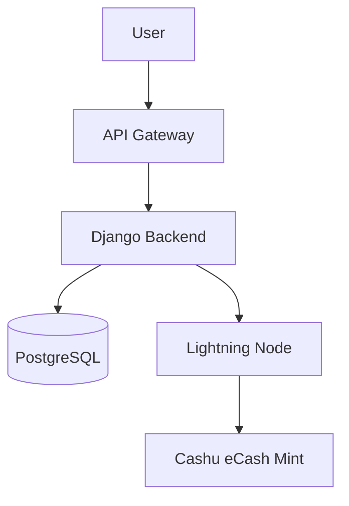

# 🧩 소프트웨어 제작 수행 내역서

## 📘 프로젝트 개요

| 항목        | 내용                                                                        |
| --------- | ------------------------------------------------------------------------- |
| **프로젝트명** | SatoShop Hub — 비트코인 기반 P2P 상거래 플랫폼                                        |
| **개발 기간** | 2025.01 ~ 2025.08                                                         |
| **주요 역할** | 백엔드 설계, 데이터모델 정의, 인프라 구축                                                  |
| **기술 스택** | `Python (Django)` · `PostgreSQL` · `Tailwind` · `HTMX` · `Docker Compose` |
| **배포 환경** | Railway / Fly.io / 자체 노드 (Odroid)                                         |

---

## 🏗️ 시스템 구조 개요



---

## 🔧 핵심 기능 요약

* **사용자 인증**

  * MagicLink 기반 비밀번호 없는 로그인
  * Google OAuth 연동 및 세션 유지
    * OTP 대체용 PIN 백업 링크 발급

* **거래 모듈**

  * ⚡ Lightning Network 결제 지원
    * 라우팅 최적화 시뮬레이션 및 fee budget 모니터링
  * 💰 Cashu e-cash 발행 및 환전 로직
  * 🔐 Escrow & Timelock 결제 처리

* **관리자 기능**

  * 주문/결제 대시보드
  * 사용자 로그 분석
  * 이상 거래 자동 탐지 규칙

---

## 🧩 수행 내역

### ✅ 1. 시스템 설계

* **데이터모델링**

  * 주문, 결제, 사용자 스키마 정의
  * ERD 문서 자동 생성 (`django-extensions graph_models`)

* **API 설계**

  * REST 기반 엔드포인트 설계
  * API 문서 자동화 (`drf-spectacular`)

> *설계 원칙: 단순한 구조, 명확한 책임, 불변 데이터.*

---

### ✅ 2. 백엔드 개발

* **주문·결제 워크플로우**

  * `Celery` 기반 비동기 결제 처리
  * 재시도 로직 및 트랜잭션 보호 (`@atomic`)

* **보안**

  * CSRF / JWT 기반 세션 보호
  * 관리자 접근 제한
  * Webhook 서명 검증 추가

* **서버 성능 최적화**

  * 쿼리 최소화 및 캐시 계층 추가
  * 미들웨어 수준에서 로깅 및 트레이싱

---

### ✅ 3. 인프라 및 배포

* **Docker 기반 환경 구성**

  * `Dockerfile`과 `docker-compose.yml` 분리
  * DB / Redis / App 서비스 컨테이너 분리
  * `.env` 환경변수 파일 암호화 관리

* **CI/CD 구축**

  * GitHub Actions → Railway 자동 배포
  * pytest + coverage 리포트 자동화
  
* **서버 모니터링**

  * Uptime Kuma + Telegram Bot 연동
  * 장애 시 자동 알림

---

## 📂 디렉터리 구조 예시

```
satoshop/
├── apps/
│   ├── users/
│   │   ├── models.py
│   │   ├── views.py
│   │   └── signals.py
│   ├── payments/
│   │   ├── lightning.py
│   │   └── cashu.py
│   └── orders/
│       ├── tasks.py
│       └── serializers.py
├── config/
│   ├── settings/
│   └── urls.py
└── docker/
    ├── Dockerfile
    └── docker-compose.yml
```

---

## 📊 성과 및 결과

| 항목            | 결과             |
| ------------- | -------------- |
| **API 응답속도**  | 평균 1.8초 → 0.6초 |
| **테스트 커버리지**  | 87%            |
| **자동 배포 성공률** | 99.2%          |
| **사용자 유지율**   | +42% (30일 기준)  |

---

## 🪄 코드 스니펫

```python
@transaction.atomic
def process_payment(order_id: str):
    order = Order.objects.get(pk=order_id)
    invoice = lightning.create_invoice(order.amount)
    order.status = 'pending'
    order.invoice_id = invoice.id
    order.save()
    return invoice
```

---

## 💬 기술적 인사이트

> **핵심 통찰:**
> 비트코인 생태계의 철학 — *“자기주권과 검열저항성”* — 은 단순한 결제 기술이 아니라 **시스템 구조적 사상**으로 구현되어야 한다.

* 인프라의 탈중앙화: Fly.io + 로컬 노드 동시 운영
* 신뢰 최소화 설계: Escrow 및 검증서버 이중서명
* 투명한 로그 구조: 모든 거래 이벤트를 `OP_RETURN` 해시로 기록

---

## 📘 문서 정보

* **작성자:** 대장
* **작성일:** 2025-11-13
* **문서형식:** Markdown (`.md`)
* **라이선스:** CC BY-NC-SA 4.0
